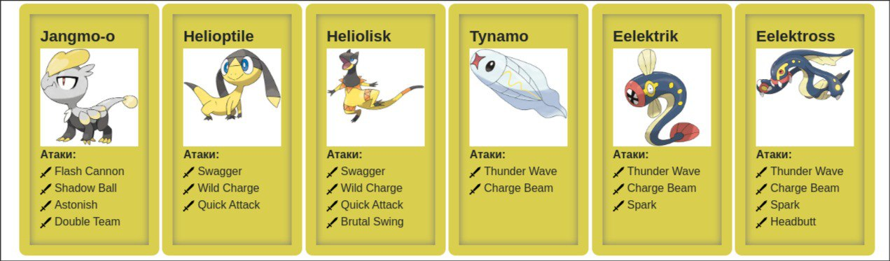

# Pokemon Battle Simulation

## Overview

This project is a Pokemon battle simulation implemented in Java. It models different Pokemon species, their moves, and battle mechanics using object-oriented programming principles. The simulation is based on the Pokemon series and provides an interactive way to simulate battles between different Pokemon.

## Features

- Implementation of various Pokemon species with unique stats and move sets.
- A collection of Pokemon moves, including physical, special, and status moves.
- Simulation of battles where Pokemon can use their abilities to attack, defend, and inflict status effects.
- Object-oriented design utilizing inheritance and polymorphism.

## Structure

The project consists of two main categories:

1. **Pokemon Classes**

    - `Tynamo.java`
    - `Eelektrik.java`
    - `Eelektros.java`
    - `JangmoO.java`
    - `Helioptile.java`
    - `Heliolisk.java`

2. **Move Classes**

    - `BrutalSwing.java`
    - `Astonish.java`
    - `FlashCannon.java`
    - `DoubleTeam.java`
    - `QuickAttack.java`
    - `Spark.java`
    - `ChargeBeam.java`
    - `ShadowBall.java`
    - `Swagger.java`
    - `ThunderWave.java`
    - `WildCharge.java`
    - `Headbutt.java`

3. **Main Class**

    - `Main.java` - The entry point for the program, which initializes a battle between two Pokemon:
      ```java
      import ru.ifmo.se.pokemon.*;
      import pokemon.JangmoO;
      import pokemon.Heliolisk;
 
      public class Main {
          public static void main(String[] args) {
              Battle b = new Battle();
 
              Pokemon p1 = new JangmoO("Чужой", 1);
              Pokemon p2 = new Heliolisk("Хищник", 1);
 
              b.addAlly(p1);
              b.addFoe(p2);
 
              b.go();
          }
      }
      ```

## Move and Pokemon Logic

### Move Types:
- **Physical Moves:** These moves deal damage based on the attacker's Attack stat and the defender's Defense stat.
- **Special Moves:** These moves deal damage based on the attacker's Special Attack stat and the defender's Special Defense stat.
- **Status Moves:** These moves do not deal direct damage but can apply status effects like paralysis, confusion, or evasion boosts.

Each move has attributes such as type (e.g., Electric, Normal), base power, accuracy, and additional effects like flinching or stat changes.

### Pokemon Classes:
- Each Pokemon class extends `Pokemon` and defines specific stats such as HP, Attack, Defense, Special Attack, Special Defense, and Speed.
- Pokemon can have multiple move slots, and each species is assigned a set of moves that reflect its abilities from the original Pokemon games.
- The battle system follows turn-based mechanics, where Pokemon use their moves according to their speed and priority values.

## Dependencies

This project relies on the `ru.ifmo.se.pokemon` package, which provides the necessary base classes for the Pokemon and their moves.

## Setup and Execution

### Compiling the Project
1. Ensure you have Java installed on your system.
2. Compile the Java files using:
   ```sh
   javac -cp "./libs/Pokemon.jar" -d bin $(find src -name "*.java")
   ```

### Creating a JAR File
1. Package the compiled classes into a JAR file:
   ```sh
   jar cfm PokemonBattle.jar ./META-INF/MANIFEST.mf -C bin .
   ```

### Running the JAR File
Run the program using:
   ```sh
   java -jar PokemonBattle.jar
   ```
Manifest-Version: 1.0
Main-Class: Main
Class-Path: Pokemon.jar

## Source and References

The information about Pokemon species and moves was obtained from [Pokemon Database](https://pokemondb.net/).

## Pokemons info


## 
